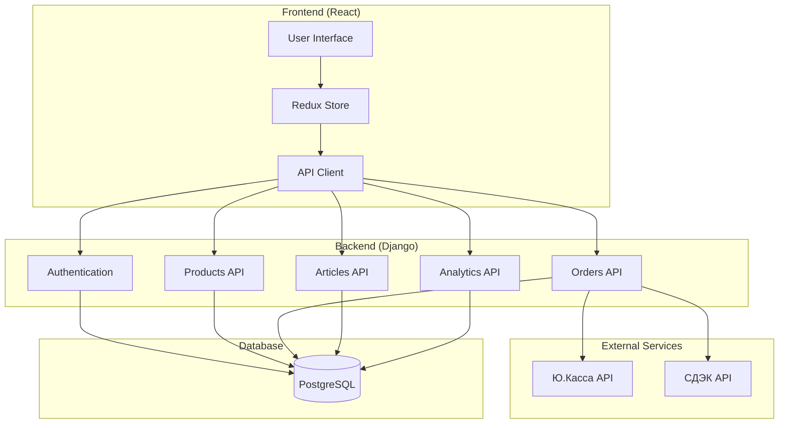

# Документ проектирования системы

## Обзор

Интернет-магазин "Pkubg" представляет собой современное веб-приложение для продажи низкобелковой и безглютеновой продукции. Система построена на микросервисной архитектуре с разделением на фронтенд (React) и бэкенд (Django REST API), что обеспечивает масштабируемость и удобство разработки.

Ключевые особенности системы:
- Адаптивный пользовательский интерфейс с современным дизайном
- Интеграция с внешними сервисами (Ю.Касса, СДЭК)
- Ролевая модель доступа (пользователь, менеджер, администратор)
- Система управления контентом для товаров и статей
- Аналитика и мониторинг пользовательского поведения

## Архитектура

### Общая архитектура

Система использует трехуровневую архитектуру:

1. **Презентационный уровень**: React SPA с современным UI/UX
2. **Логический уровень**: Django REST API с бизнес-логикой
3. **Уровень данных**: PostgreSQL с оптимизированной схемой

### Архитектурные принципы

- **Разделение ответственности**: Четкое разделение между фронтендом и бэкендом
- **API-First подход**: Все взаимодействие через RESTful API
- **Модульность**: Каждая функциональность выделена в отдельные модули
- **Безопасность**: JWT аутентификация и авторизация на основе ролей
- **Производительность**: Кэширование, оптимизация запросов, CDN для статики

### Диаграмма компонентов



## Компоненты и интерфейсы

### Frontend компоненты (React)

#### Основные компоненты
- **App**: Корневой компонент с роутингом
- **Header**: Навигация, корзина, авторизация
- **ProductCatalog**: Каталог товаров с фильтрацией
- **ProductCard**: Карточка товара
- **ShoppingCart**: Корзина покупок
- **UserProfile**: Личный кабинет
- **AdminPanel**: Панель администратора
- **ArticleList/ArticleEditor**: Управление статьями

#### Состояние приложения (Redux)
```javascript
{
  auth: {
    user: User | null,
    token: string | null,
    isAuthenticated: boolean
  },
  products: {
    items: Product[],
    categories: Category[],
    filters: FilterState,
    loading: boolean
  },
  cart: {
    items: CartItem[],
    total: number,
    count: number
  },
  orders: {
    current: Order | null,
    history: Order[]
  }
}
```

### Backend API (Django REST Framework)

#### Основные приложения Django
- **accounts**: Управление пользователями и аутентификация
- **products**: Каталог товаров и категории
- **orders**: Заказы и корзина
- **articles**: Система управления контентом
- **analytics**: Аналитика и отчеты
- **integrations**: Внешние интеграции (Ю.Касса, СДЭК)

#### API Endpoints
```
/api/auth/
  POST /login/          # Вход в систему
  POST /register/       # Регистрация
  POST /logout/         # Выход
  GET  /profile/        # Профиль пользователя

/api/products/
  GET    /              # Список товаров
  GET    /{id}/         # Детали товара
  POST   /              # Создание товара (admin)
  PUT    /{id}/         # Обновление товара (admin)
  DELETE /{id}/         # Удаление товара (admin)

/api/cart/
  GET    /              # Содержимое корзины
  POST   /add/          # Добавить в корзину
  PUT    /update/       # Обновить количество
  DELETE /remove/       # Удалить из корзины

/api/orders/
  GET    /              # История заказов
  POST   /create/       # Создать заказ
  GET    /{id}/         # Детали заказа

/api/articles/
  GET    /              # Список статей
  GET    /{id}/         # Содержимое статьи
  POST   /              # Создать статью (admin/manager)
  PUT    /{id}/         # Обновить статью (admin/manager)

/api/analytics/
  GET    /cart-stats/   # Статистика корзин
```

## Модели данных

### Пользователи и роли
```python
class User(AbstractUser):
    email = EmailField(unique=True)
    first_name = CharField(max_length=150)
    last_name = CharField(max_length=150)
    phone = CharField(max_length=20, blank=True)
    role = CharField(max_length=20, choices=ROLE_CHOICES, default='customer')
    created_at = DateTimeField(auto_now_add=True)
    updated_at = DateTimeField(auto_now=True)

class UserProfile(Model):
    user = OneToOneField(User, on_delete=CASCADE)
    address = TextField(blank=True)
    birth_date = DateField(null=True, blank=True)
    dietary_preferences = JSONField(default=dict)
```

### Товары и категории
```python
class Category(Model):
    name = CharField(max_length=100)
    slug = SlugField(unique=True)
    description = TextField(blank=True)
    parent = ForeignKey('self', null=True, blank=True, on_delete=CASCADE)
    is_active = BooleanField(default=True)

class Product(Model):
    name = CharField(max_length=200)
    slug = SlugField(unique=True)
    description = TextField()
    price = DecimalField(max_digits=10, decimal_places=2)
    category = ForeignKey(Category, on_delete=CASCADE)
    is_gluten_free = BooleanField(default=False)
    is_low_protein = BooleanField(default=False)
    nutritional_info = JSONField(default=dict)
    stock_quantity = PositiveIntegerField(default=0)
    is_active = BooleanField(default=True)
    created_at = DateTimeField(auto_now_add=True)

class ProductImage(Model):
    product = ForeignKey(Product, related_name='images', on_delete=CASCADE)
    image = ImageField(upload_to='products/')
    alt_text = CharField(max_length=200)
    is_primary = BooleanField(default=False)
```

### Корзина и заказы
```python
class Cart(Model):
    user = ForeignKey(User, on_delete=CASCADE)
    created_at = DateTimeField(auto_now_add=True)
    updated_at = DateTimeField(auto_now=True)

class CartItem(Model):
    cart = ForeignKey(Cart, related_name='items', on_delete=CASCADE)
    product = ForeignKey(Product, on_delete=CASCADE)
    quantity = PositiveIntegerField(default=1)
    added_at = DateTimeField(auto_now_add=True)

class Order(Model):
    user = ForeignKey(User, on_delete=CASCADE)
    order_number = CharField(max_length=50, unique=True)
    status = CharField(max_length=20, choices=ORDER_STATUS_CHOICES)
    total_amount = DecimalField(max_digits=10, decimal_places=2)
    shipping_address = TextField()
    payment_status = CharField(max_length=20, choices=PAYMENT_STATUS_CHOICES)
    delivery_method = CharField(max_length=50)
    delivery_tracking = CharField(max_length=100, blank=True)
    created_at = DateTimeField(auto_now_add=True)

class OrderItem(Model):
    order = ForeignKey(Order, related_name='items', on_delete=CASCADE)
    product = ForeignKey(Product, on_delete=CASCADE)
    quantity = PositiveIntegerField()
    price = DecimalField(max_digits=10, decimal_places=2)
```

### Статьи и контент
```python
class Article(Model):
    title = CharField(max_length=200)
    slug = SlugField(unique=True)
    content = TextField()
    excerpt = TextField(max_length=500)
    author = ForeignKey(User, on_delete=CASCADE)
    featured_image = ImageField(upload_to='articles/', blank=True)
    is_published = BooleanField(default=False)
    created_at = DateTimeField(auto_now_add=True)
    updated_at = DateTimeField(auto_now=True)
    
class ArticleCategory(Model):
    name = CharField(max_length=100)
    slug = SlugField(unique=True)
    
class ArticleTag(Model):
    name = CharField(max_length=50)
    slug = SlugField(unique=True)
```

## Свойства корректности

*Свойство - это характеристика или поведение, которое должно выполняться во всех допустимых выполнениях системы - по сути, формальное утверждение о том, что система должна делать. Свойства служат мостом между человекочитаемыми спецификациями и машинно-проверяемыми гарантиями корректности.*

### Свойство 1: Отображение детальной информации о товаре
*Для любого* товара в системе, при отображении его детальной страницы должна присутствовать вся обязательная информация: название, описание, цена, состав, пищевая ценность и характеристики
**Проверяет: Требования 1.2**

### Свойство 2: Релевантность результатов поиска
*Для любого* поискового запроса, все возвращаемые товары должны содержать искомые термины в названии или описании
**Проверяет: Требования 1.3**

### Свойство 3: Соответствие фильтрам
*Для любого* набора примененных фильтров, все отображаемые товары должны соответствовать всем выбранным критериям
**Проверяет: Требования 1.4**

### Свойство 4: Скрытие кнопки для товаров без остатка
*Для любого* товара с нулевым количеством на складе, кнопка добавления в корзину должна быть скрыта
**Проверяет: Требования 1.5**

### Свойство 5: Обновление счетчика корзины при добавлении
*Для любого* добавления товара в корзину, счетчик товаров в иконке корзины должен увеличиться на соответствующее количество
**Проверяет: Требования 2.1**

### Свойство 6: Обновление суммы корзины при добавлении
*Для любого* добавления товара в корзину, общая сумма должна увеличиться на произведение цены товара и количества
**Проверяет: Требования 2.2**

### Свойство 7: Пересчет стоимости при изменении количества
*Для любого* изменения количества товара в корзине, общая стоимость должна равняться сумме произведений цен всех товаров на их количества
**Проверяет: Требования 2.3**

### Свойство 8: Обновление корзины при удалении товара
*Для любого* удаления товара из корзины, счетчик и общая сумма должны уменьшиться на соответствующие значения
**Проверяет: Требования 2.4**

### Свойство 9: Создание профиля при регистрации
*Для любого* нового пользователя при регистрации должен создаваться личный кабинет со всеми базовыми полями профиля
**Проверяет: Требования 3.1**

### Свойство 10: Отображение истории заказов
*Для любого* пользователя в личном кабинете должна отображаться полная история его заказов с актуальными статусами
**Проверяет: Требования 3.2**

### Свойство 11: Сохранение изменений профиля
*Для любого* обновления персональных данных пользователя, изменения должны сохраняться в базе данных и подтверждаться пользователю
**Проверяет: Требования 3.3**

### Свойство 12: Полнота информации о заказе
*Для любого* заказа при просмотре должна отображаться полная информация о товарах, доставке и статусе оплаты
**Проверяет: Требования 3.4**

### Свойство 13: Завершение сессии при выходе
*Для любого* выхода пользователя из системы, сессия должна быть завершена и произведено перенаправление на главную страницу
**Проверяет: Требования 3.5**

### Свойство 14: Корректность перенаправления на оплату
*Для любого* подтверждения оплаты должно происходить перенаправление на страницу Ю.Кассы с корректными параметрами заказа
**Проверяет: Требования 4.2**

### Свойство 15: Обновление статуса при успешной оплате
*Для любого* успешного платежа статус заказа должен обновиться на "оплачен" после получения уведомления от Ю.Кассы
**Проверяет: Требования 4.3**

### Свойство 16: Уведомление при отклонении оплаты
*Для любого* отклоненного платежа пользователь должен получить уведомление с предложением повторить попытку
**Проверяет: Требования 4.4**

### Свойство 17: Логирование ошибок платежей
*Для любой* ошибки платежа система должна записать инцидент в лог и показать понятное сообщение пользователю
**Проверяет: Требования 4.5**

### Свойство 18: Предложение пунктов выдачи СДЭК
*Для любого* указанного адреса система должна возвращать список ближайших пунктов выдачи СДЭК
**Проверяет: Требования 5.2**

### Свойство 19: Создание заявки доставки СДЭК
*Для любого* оформленного заказа с доставкой СДЭК должна создаваться соответствующая заявка в системе СДЭК
**Проверяет: Требования 5.3**

### Свойство 20: Обновление статуса доставки
*Для любого* изменения статуса доставки в СДЭК система должна получить уведомление и обновить информацию в заказе
**Проверяет: Требования 5.4**

### Свойство 21: Уведомление о доставке
*Для любого* заказа со статусом "доставлен" пользователь должен получить уведомление о получении товара
**Проверяет: Требования 5.5**

### Свойство 22: Сохранение полной информации о товаре
*Для любого* товара, добавляемого администратором, должны сохраняться все обязательные поля: название, описание, цена и характеристики
**Проверяет: Требования 6.1**

### Свойство 23: Отражение изменений товара в каталоге
*Для любого* изменения товара администратором, обновления должны немедленно отражаться в каталоге
**Проверяет: Требования 6.2**

### Свойство 24: Корректное удаление товара
*Для любого* удаляемого товара он должен исчезнуть из каталога, но существующие заказы с этим товаром должны остаться валидными
**Проверяет: Требования 6.3**

### Свойство 25: Оптимизация загружаемых изображений
*Для любого* загружаемого изображения товара оно должно сохраняться в оптимизированном формате с подходящим разрешением
**Проверяет: Требования 6.4**

### Свойство 26: Запрет доступа неавторизованным пользователям
*Для любого* неавторизованного пользователя попытка управления товарами должна быть отклонена с перенаправлением на страницу входа
**Проверяет: Требования 6.5**

### Свойство 27: Сохранение контента статьи
*Для любой* создаваемой администратором статьи должен сохраняться весь контент включая форматирование и изображения
**Проверяет: Требования 7.1**

### Свойство 28: Обновление метаданных статьи
*Для любой* редактируемой менеджером статьи должно обновляться содержимое и дата последнего изменения
**Проверяет: Требования 7.2**

### Свойство 29: Публикация статьи
*Для любой* публикуемой статьи она должна стать доступной для просмотра всем пользователям сайта
**Проверяет: Требования 7.3**

### Свойство 30: Запрет создания статей обычными пользователями
*Для любого* обычного пользователя доступ к функциям создания и редактирования статей должен быть запрещен
**Проверяет: Требования 7.4**

### Свойство 31: Архивирование удаленных статей
*Для любой* удаляемой статьи она должна исчезнуть из публичного доступа, но остаться в архиве системы
**Проверяет: Требования 7.5**

### Свойство 32: Адаптивность интерфейса
*Для любого* мобильного устройства интерфейс должен корректно адаптироваться под размер экрана
**Проверяет: Требования 8.3**

### Свойство 33: Визуальная обратная связь
*Для любого* интерактивного элемента при наведении курсора должна предоставляться визуальная обратная связь
**Проверяет: Требования 8.4**

### Свойство 34: Производительность загрузки
*Для любой* страницы время загрузки контента не должно превышать разумных пределов без блокировки интерфейса
**Проверяет: Требования 8.5**

### Свойство 35: RESTful API структура
*Для любого* API endpoint структура запросов и ответов должна соответствовать принципам REST
**Проверяет: Требования 9.4**

### Свойство 36: Отображение общего количества товаров в корзинах
*Для любого* момента времени панель аналитики должна показывать корректное общее количество товаров во всех активных корзинах
**Проверяет: Требования 10.1**

### Свойство 37: Расчет общей суммы корзин
*Для любого* момента времени система должна корректно рассчитывать общую сумму товаров во всех корзинах пользователей
**Проверяет: Требования 10.2**

### Свойство 38: Обновление статистики при изменении корзин
*Для любого* добавления товара в корзину общая статистика должна обновляться в реальном времени
**Проверяет: Требования 10.3**

### Свойство 39: Пересчет статистики при удалении из корзин
*Для любого* удаления товара из корзины общие показатели должны пересчитываться корректно
**Проверяет: Требования 10.4**

### Свойство 40: Исключение заказов из статистики корзин
*Для любой* корзины, конвертированной в заказ, она должна быть исключена из статистики активных корзин
**Проверяет: Требования 10.5**

## Обработка ошибок

### Стратегия обработки ошибок

1. **Валидация данных**
   - Клиентская валидация для немедленной обратной связи
   - Серверная валидация для безопасности
   - Понятные сообщения об ошибках на русском языке

2. **Обработка сетевых ошибок**
   - Автоматические повторные попытки для временных сбоев
   - Graceful degradation при недоступности внешних сервисов
   - Кэширование критически важных данных

3. **Логирование и мониторинг**
   - Структурированное логирование всех ошибок
   - Интеграция с системами мониторинга
   - Алерты для критических ошибок

4. **Пользовательский опыт**
   - Информативные сообщения об ошибках
   - Предложения по исправлению проблем
   - Сохранение пользовательских данных при ошибках

### Типы ошибок и их обработка

```python
# Пример обработки ошибок в Django
class APIErrorHandler:
    def handle_validation_error(self, error):
        return Response({
            'error': 'validation_failed',
            'message': 'Проверьте правильность введенных данных',
            'details': error.detail
        }, status=400)
    
    def handle_payment_error(self, error):
        logger.error(f"Payment error: {error}")
        return Response({
            'error': 'payment_failed',
            'message': 'Ошибка при обработке платежа. Попробуйте еще раз.',
            'retry_available': True
        }, status=402)
    
    def handle_external_service_error(self, service, error):
        logger.error(f"{service} service error: {error}")
        return Response({
            'error': 'service_unavailable',
            'message': f'Сервис {service} временно недоступен',
            'estimated_recovery': '5 минут'
        }, status=503)
```

## Стратегия тестирования

### Двойной подход к тестированию

Система использует комплексный подход к тестированию, включающий как модульные тесты, так и тестирование на основе свойств:

- **Модульные тесты** проверяют конкретные примеры, граничные случаи и условия ошибок
- **Тесты на основе свойств** проверяют универсальные свойства, которые должны выполняться для всех входных данных
- Вместе они обеспечивают всестороннее покрытие: модульные тесты выявляют конкретные ошибки, тесты свойств проверяют общую корректность

### Модульное тестирование

Модульные тесты часто покрывают:
- Конкретные примеры, демонстрирующие правильное поведение
- Точки интеграции между компонентами
- Модульные тесты полезны, но следует избегать написания слишком большого их количества
- Задача тестов на основе свойств - обрабатывать множество входных данных

### Тестирование на основе свойств

**Требования к тестированию на основе свойств:**
- Использовать библиотеку Hypothesis для Python/Django для тестирования на основе свойств
- Настроить каждый тест на основе свойств для выполнения минимум 100 итераций
- Каждый тест на основе свойств должен быть помечен комментарием, явно ссылающимся на свойство корректности в документе проектирования
- Использовать точный формат тегов: '**Feature: pkubg-ecommerce, Property {number}: {property_text}**'
- Каждое свойство корректности должно быть реализовано ОДНИМ тестом на основе свойств

### Структура тестирования

```python
# Пример теста на основе свойств
from hypothesis import given, strategies as st
import pytest

class TestCartProperties:
    @given(st.lists(st.integers(min_value=1, max_value=1000), min_size=1))
    def test_cart_total_calculation(self, quantities):
        """
        **Feature: pkubg-ecommerce, Property 7: Пересчет стоимости при изменении количества**
        """
        # Генерируем случайные товары и количества
        cart = Cart()
        products = [create_test_product(price=100) for _ in quantities]
        
        # Добавляем товары в корзину
        for product, qty in zip(products, quantities):
            cart.add_item(product, qty)
        
        # Проверяем, что общая стоимость равна сумме произведений
        expected_total = sum(product.price * qty for product, qty in zip(products, quantities))
        assert cart.total == expected_total

# Пример модульного теста
class TestCartFunctionality:
    def test_empty_cart_display(self):
        """Тест отображения пустой корзины"""
        cart = Cart()
        assert cart.is_empty()
        assert "Корзина пуста" in cart.render()
        assert not cart.can_checkout()
```

### Покрытие тестами

- **Frontend тесты**: Jest + React Testing Library для компонентов React
- **Backend тесты**: pytest + Django Test Framework
- **Интеграционные тесты**: Selenium для end-to-end тестирования
- **API тесты**: pytest + requests для тестирования REST API
- **Тесты производительности**: locust для нагрузочного тестирования

### Непрерывная интеграция

```yaml
# Пример GitHub Actions workflow
name: Test Suite
on: [push, pull_request]
jobs:
  test:
    runs-on: ubuntu-latest
    steps:
      - uses: actions/checkout@v2
      - name: Setup Python
        uses: actions/setup-python@v2
        with:
          python-version: 3.11
      - name: Install dependencies
        run: |
          pip install -r requirements.txt
          npm install
      - name: Run backend tests
        run: pytest --cov=. --cov-report=xml
      - name: Run frontend tests
        run: npm test -- --coverage
      - name: Run property-based tests
        run: pytest -m property_tests --hypothesis-show-statistics
```